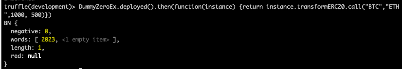

# Eulith_CodeExercise02

## Your background knowledge going into this exercise:
I regret coasting through my BlockChain class this time last year when I was busy grinding leetcode and interviewing with other companies. Ironically, I'm still doing the same thing right now. So when I started to work on the exercise, I had to study blockchain-related concepts all over again. I haven't use Rust before, but I wrote C++ for three months at Meta so I'm interested to see the comparison.

## The time you spend on the exersice.
On Dec.16, I spent 1~2 hours going over BlockChain 101, 0x protocal. Then another 1 hour setting up the private blockchain on my laptop(using geth)

On Dec. 17th, I spent 3~4 hours coding and studying the documentation of the tools that I used (solidity, truffle) and finally came up with a workable solution.

## Your questions and explanations

This is a good exercise to get a general idea of how blockchain works. To simplify things, I just initiated one node (node01) on my laptop. I created two accounts and some transactions betweeen these two accounts and balances would only be changed after miner started running.

I used truffle because this is the first one that I found. it helps initiate a project and it has some useful commandline tools like "truffle console" and "truffle test"

Please check out the contract code under truffle_proj/contracts/DummyZeroEx.sol, where I put some commnets. I set the constant value to be 2023.

There are two ways of testing, one is calling the function in the dummy contract and print the result:

another way of testing is to write a test contract (truffle_proj/test/DummyZeroExTest.sol) and run "truffle test", it would run the contract on local blockchain, grab the result and do assertion for me.